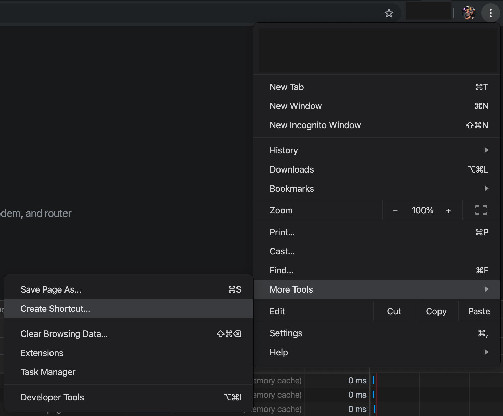
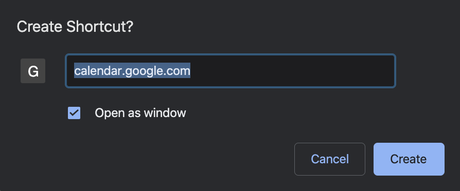
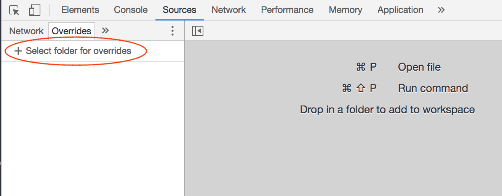
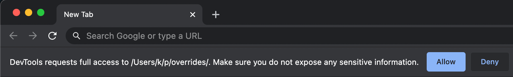
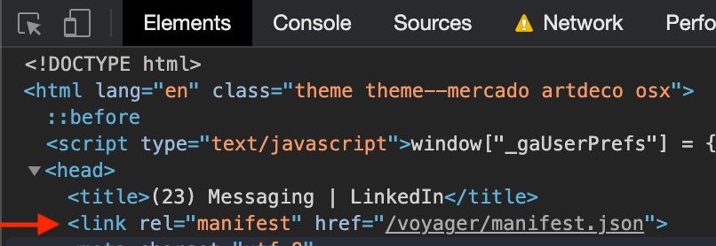
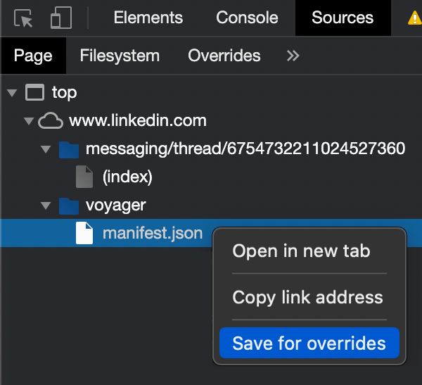

# PWA Tricks

A collection of helpful tricks for PWAs (Progressive Web Apps) and [Chrome Pseudo-PWA](#chrome-pseudo-pwas)

## Change Starting URL of PWA in Chrome

Sometimes PWAs don't behave in an ideal manner, such as in the following cases:

- [Google Calendar doesn't allow for multiple Pseudo-PWA shortcuts to different accounts](https://apple.stackexchange.com/questions/390799/how-to-change-the-url-of-a-chrome-app-shortcut)
- LinkedIn Messaging will [show an ugly black bar](./linkedin-messaging-black-bar.png) if you navigate to another message
- Some PWAs may not start on the correct URL

In these cases it can be helpful to change the `start_url` in the [web app manifest](https://www.w3.org/TR/appmanifest/) for the PWA.

### Solution 1: Add a Web App Manifest

Before you install or create the shortcut for the PWA, add a web app manifest with your chosen `start_url` to the page:

1. Copy the JavaScript below
2. On the page of the application, open the Chrome DevTools (right click anywhere on the page and select "Inspect")
3. Go to the Console tab and paste the copied JavaScript
4. Modify the URL if necessary to whatever URL you are trying to create an app for (this example is for creating a second Google Calendar Pseudo-PWA)
5. Hit return to run the JavaScript

```js
const startUrl = 'https://calendar.google.com/calendar/u/1/r';
document.head
  .querySelector(':first-child')
  .insertAdjacentHTML(
    'beforebegin',
    `<link rel="manifest" href='data:application/manifest+json,{"start_url":"${startUrl}"}' />`,
  );
```

Once you have done this, you can install the PWA as normal.

Or, if you need to create a shortcut for a pseudo-PWA:

6. Click on the three dots menu > More Tools > Create Shortcut<br /><br />
   <br /><br />
7. Check "Open as window" and select "Create"<br /><br />
   <br /><br />

## Solution 2: Edit an Existing Web App Manifest

If the page either specifies a manifest already or sets the Content Security Policy directive `manifest-src`, then the above solution may not work, potentially also returning an error such as:

```
Refused to load manifest from 'data:application/manifest+json,...' because it violates the following Content Security Policy directive: "manifest-src 'self'".
```

To get around this, you can use [Chrome Local Overrides](https://developers.google.com/web/updates/2018/01/devtools#overrides) to modify the `start_url` in the Web App Manifest, as in the guides below.

Both of these guides require Local Overrides to be set up, like this:

1. Open the `Sources` tab in the Chrome DevTools. If you have not used overrides before, you will need to set them up:
   - Switch to the `Overrides` 2nd-level tab (you may need to find it in the `»` menu)
   - If you Create a new folder in your `projects` or `Documents` folder called `chrome-overrides`
   - Click on `＋ Select folder for overrides` and select the folder you created<br /><br />
     <br /><br />
   - Confirm any prompts at the top of the browser asking for access to the folder<br /><br />
     <br /><br />
2. Refresh the page.

### With an Existing Manifest `link`

If there is an existing manifest on the page (`document.querySelectorAll('link[rel="manifest"]').length` returns `1`), then you can modify it like this:

1. Locate and expand the `<head>` element under Elements in the Chrome DevTools and locate the `link` element with `rel="manifest"`. Note the file path in `href`.<br /><br />
   <br /><br />
2. Go to the Sources tab and select the Page tab. Locate the web app manifest corresponding to the file path you noted earlier. Right click and select `Save for overrides`:<br /><br />
   <br /><br />
3. Now the web app manifest is editable! Make your changes to `start_url` or anything else that you need, save the file and reload the page
4. The updated web app manifest has now been loaded, and you can install or create a shortcut to the PWA as normal 🙌
5. You can now remove the overrides (right click on the folder with the domain name -> Delete all overrides)

### Without a Manifest `link`

If there isn't yet a manifest on the page (`document.querySelectorAll('link[rel="manifest"]').length` returns `0`), then you can add one like this:

1. Locate and expand the `<head>` element under Elements in the Chrome DevTools. Right click on the `<head>` element and select `Edit as HTML`. Copy and paste the following code inside the head tag, at the beginning (before all other elements):<br /><br />
   ```
   <link rel="manifest" href="/manifest-temp-pwa-tricks-0123456789.json" />
   ```
   <br />
2. This will trigger a network request to that file. Go to the Network tab, locate the request entry, right-click on it and select `Save for overrides`
3. Now the web app manifest is editable! Make your changes to `start_url` or anything else that you need and save the file.
4. Reload the page and do step 1 again - edit the `<head>` and add the `link` to the newly-created manifest
5. The updated web app manifest has now been loaded, and you can install or create a shortcut to the PWA as normal 🙌
6. You can now remove the overrides (right click on the folder with the domain name -> Delete all overrides)

## Chrome Pseudo-PWAs

Chrome Pseudo-PWAs (aka shortcuts in new windows) can be created for any website or web application, and behave similarly to full desktop applications on your computer (see https://twitter.com/karlhorky/status/1127884049073233920).
